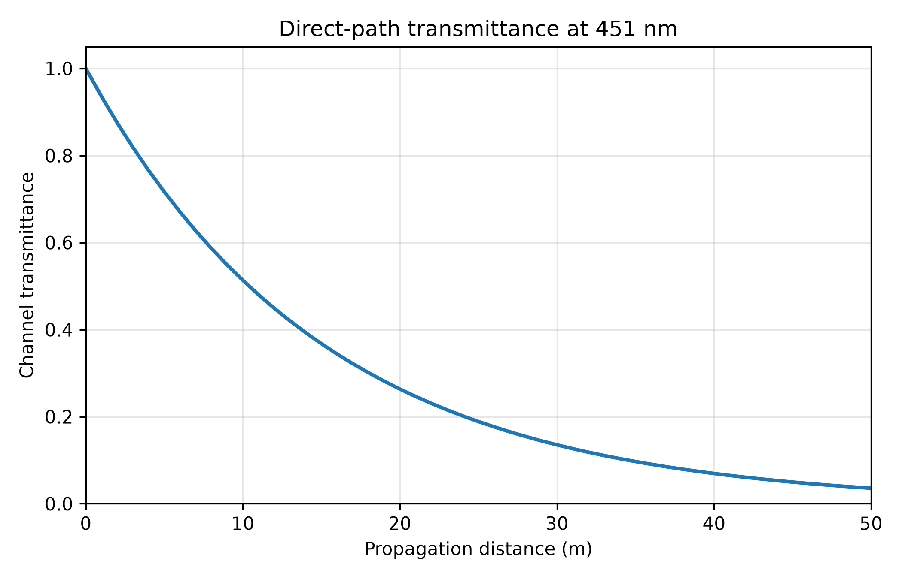

# OceanSenseAI

[](https://github.com/subhashreedas-rd/OceanSenseAI/actions/workflows/tests.yml)

*A research project exploring the physics and modelling of underwater optical communication channels.*

OceanSenseAI investigates how light propagates through water and how underwater channel conditions affect optical communication performance.

The current work focuses on physics-based channel modelling, traceable parameter selection, model verification, and comparison with published data. Later studies will extend the framework to optical sources, receivers, signal processing, and communication-performance analysis.

---

## Current Research

### Study 01 — Characterisation of Underwater Optical Transmission

**Research question**

> How do propagation distance, wavelength, absorption, and scattering influence underwater optical transmission?

Study 01 develops a baseline direct-path propagation model using the Beer–Lambert attenuation law.

The current implementation:

- reads published optical-channel parameters;
- calculates transmittance and path loss;
- verifies known limiting cases;
- performs distance-sweep analyses;
- compares direct-path loss across different water types;
- checks parameter provenance and internal consistency.

The model currently assumes homogeneous water. It does not include receiver geometry, beam divergence, multiple scattering, turbulence, temporal dispersion, or alignment errors.

Detailed assumptions, equations, verification requirements, results, and limitations are documented in [`docs/STUDY_01.md`](docs/STUDY_01.md).

---

## Current Progress

| Task | Status |
|---|---|
| Study 01 scope and methodology | Complete |
| Core literature set selected | Complete |
| Experimental attenuation benchmark | Complete |
| Water-type parameter extraction | Complete |
| Parameter provenance and consistency checks | Complete |
| Beer–Lambert propagation model | Complete |
| Automated propagation tests | Complete |
| Distance-sweep analysis | Complete |
| Water-type comparison | Complete |
| GitHub Actions test workflow | Complete |
| Wavelength-dependent analysis | Planned |
| Additional published-data benchmarking | Planned |

---

## Current Results

### Experimental Attenuation Benchmark

Using a published experimental attenuation coefficient of \(0.0667\ \mathrm{m^{-1}}\) at 451 nm, the model predicts that direct-path transmittance decreases from 1 at zero distance to approximately 0.036 at 50 m.



This result represents one measured water condition and should not be interpreted as a general model for all underwater environments.

### Comparison Across Water Types

A second analysis compares four literature-based coefficient sets representing pure sea, clear ocean, coastal water, and turbid harbour water.


The comparison shows that direct-path loss is strongly dependent on water condition. These coefficient sets are simulation references rather than measurements collected within this project.

---

## Research Direction

Planned development includes:

1. wavelength-dependent absorption and scattering;
2. comparison with additional measured datasets;
3. optical source modelling;
4. receiver and detector modelling;
5. signal and noise analysis;
6. bit-error-rate evaluation;
7. sensitivity and uncertainty analysis;
8. assessment of model limits beyond direct-path attenuation.

---

## Scientific Approach

- Use physical reasoning before adding software complexity.
- Record the origin and permitted use of model parameters.
- Verify numerical models before interpreting their outputs.
- State assumptions and limitations explicitly.
- Keep simulation, published-data benchmarking, and experimental validation distinct.
- Prevent unresolved or inconsistent parameters from entering simulations.
- Add new features only when they support a defined research question.

---

## Repository Structure

```text
OceanSenseAI/
├── .github/
│   └── workflows/
├── database/
│   ├── experimental_benchmarks/
│   └── model_parameters/
├── docs/
├── figures/
│   └── study_01/
├── src/
├── studies/
│   └── study_01/
├── tests/
├── .gitignore
├── README.md
└── requirements.txt
```

---

## Running Study 01

Install the required Python package:

```bash
python -m pip install -r requirements.txt
```

Run the experimental distance sweep:

```bash
python -m studies.study_01.run_distance_sweep
```

Run the water-type comparison:

```bash
python -m studies.study_01.compare_water_types
```

Run the core propagation calculation:

```bash
python src/propagation.py
```

Validate the parameter tables:

```bash
python src/validate_parameters.py
```

Run the automated tests:

```bash
python -m unittest discover -s tests -v
```

The study scripts generate:

```text
studies/study_01/results/distance_sweep.csv
studies/study_01/results/water_type_comparison.csv
figures/study_01/transmittance_vs_distance.png
figures/study_01/water_type_comparison.png
```

---

## Project Status

OceanSenseAI is under active development.

Study 01 currently provides a tested Beer–Lambert baseline, one experimental attenuation benchmark, a comparison across four literature-based water conditions, parameter-provenance checks, and automated testing.

The next stage is to introduce wavelength-dependent optical-property data and compare the model with additional published measurements.