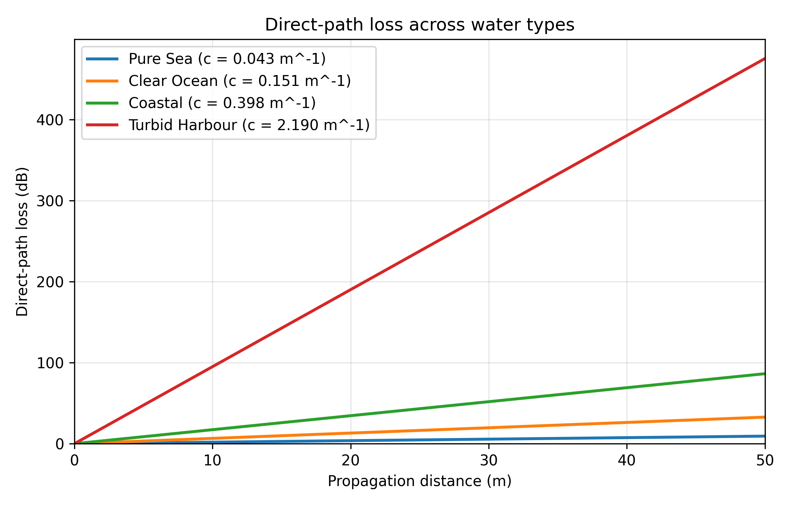
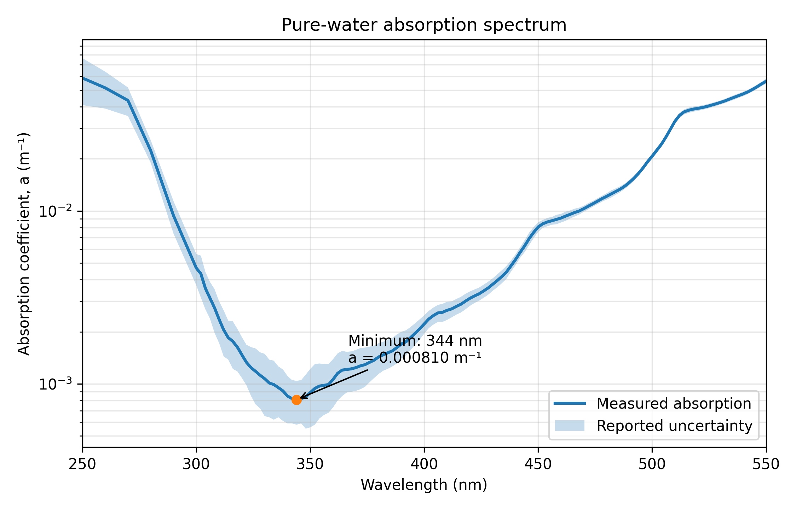
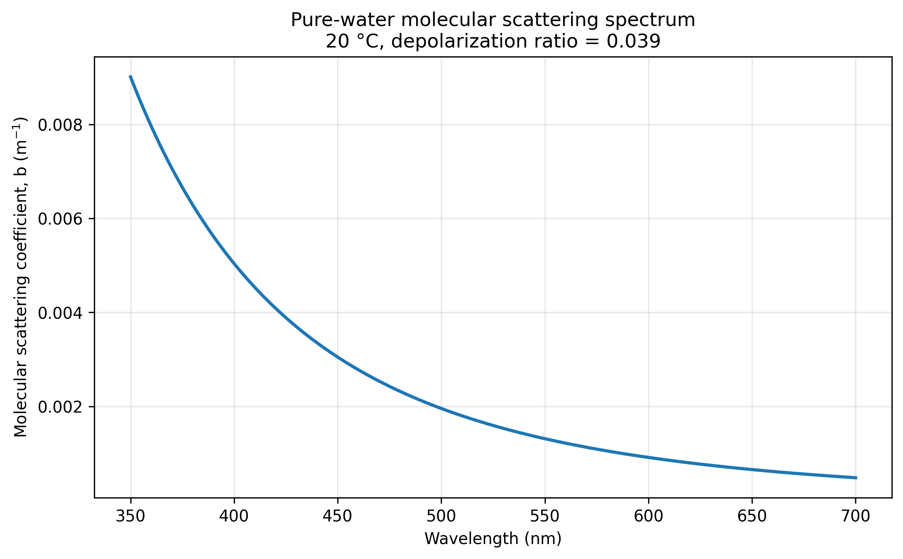
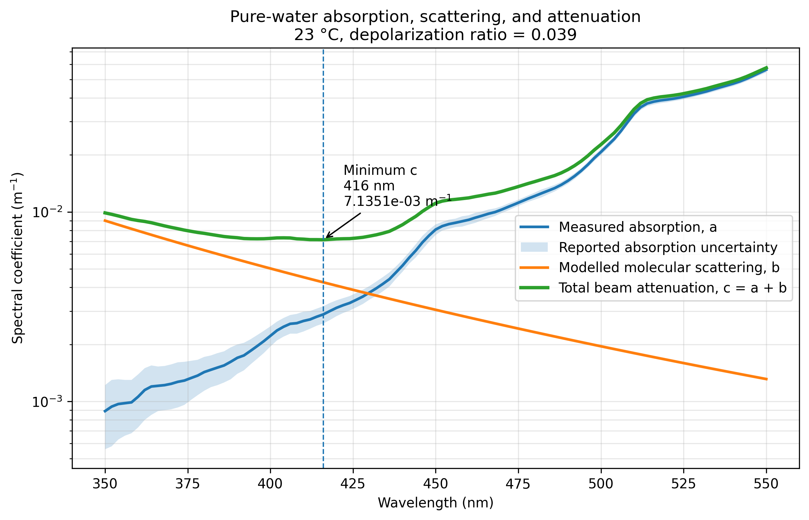
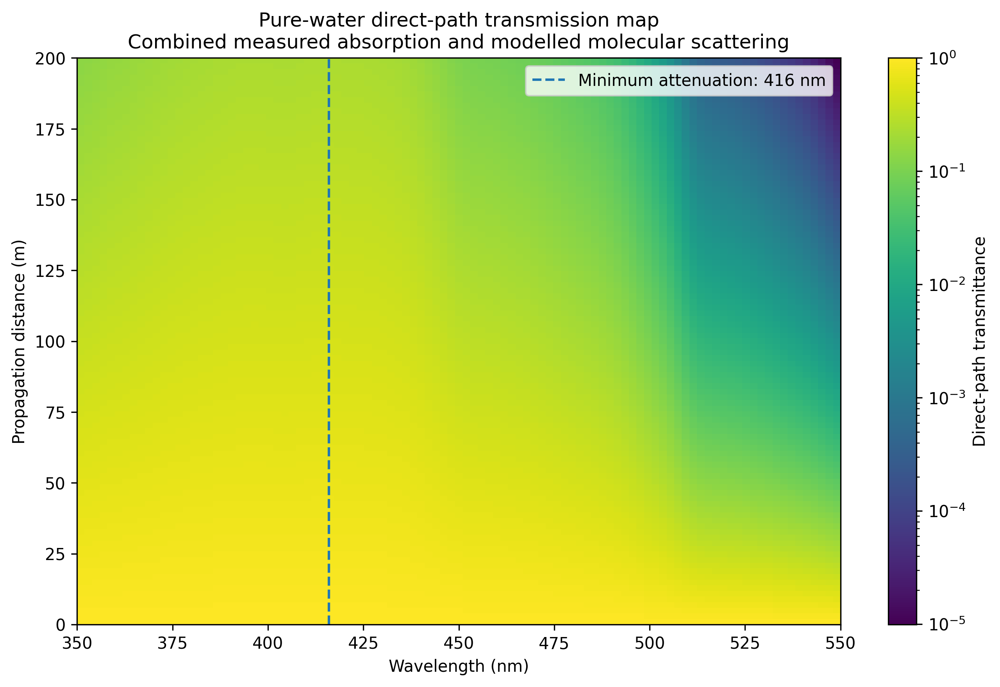
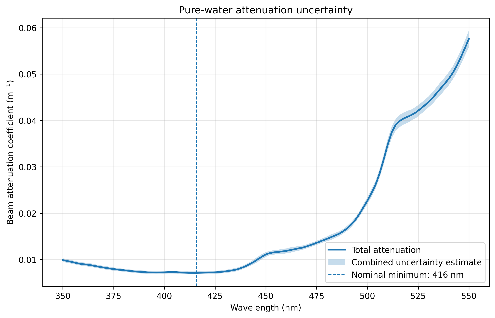
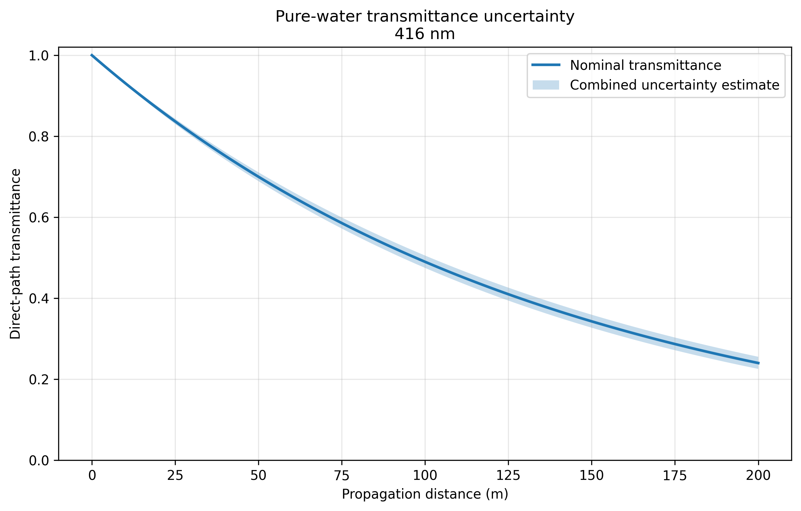

# Study 01 — Characterisation of Underwater Optical Transmission

## Research Question

> How do propagation distance, wavelength, absorption, and scattering influence underwater optical transmission?

## Purpose

Before modelling receivers, noise, or bit errors, the optical channel itself must be understood.

This study develops a baseline model relating the optical properties of water to channel transmittance and received direct-path optical power.

---

## Model Scope

The present model considers direct-path attenuation through homogeneous water.

It includes:

- wavelength-dependent absorption;
- wavelength-dependent molecular scattering;
- beam attenuation;
- propagation distance;
- channel transmittance;
- received direct-path optical power.

It does not yet include:

- receiver aperture or field of view;
- beam divergence;
- multiple scattering;
- turbulence;
- temporal dispersion;
- alignment errors;
- polarisation effects;
- time-dependent water conditions.

The model is therefore a first-order description rather than a complete underwater optical channel model.

---

## Notation

| Symbol | Meaning | Unit |
|---|---|---|
| \(L\) | Propagation distance | m |
| \(\lambda\) | Optical wavelength | nm or m |
| \(a(\lambda)\) | Absorption coefficient | \(\mathrm{m^{-1}}\) |
| \(b(\lambda)\) | Scattering coefficient | \(\mathrm{m^{-1}}\) |
| \(c(\lambda)\) | Beam attenuation coefficient | \(\mathrm{m^{-1}}\) |
| \(P_t\) | Transmitted optical power | W |
| \(P_r\) | Received direct-path optical power | W |
| \(T\) | Channel transmittance | Dimensionless |
| \(\tau\) | Optical depth | Dimensionless |
| \(\beta(90,\lambda,T)\) | Volume scattering function at \(90^\circ\) | \(\mathrm{m^{-1}\,sr^{-1}}\) |
| \(\delta\) | Molecular depolarisation ratio | Dimensionless |

---

## Physical Background

### Absorption

Absorption removes optical energy from the propagating light field.

The wavelength-dependent absorption coefficient is written as:

$$
a(\lambda).
$$

### Scattering

Scattering changes the direction of light propagation.

A scattered photon is not necessarily destroyed, but it may leave the direct optical path and fail to reach the receiver.

The wavelength-dependent scattering coefficient is written as:

$$
b(\lambda).
$$

### Beam Attenuation

For a homogeneous medium, the beam attenuation coefficient is:

$$
c(\lambda)=a(\lambda)+b(\lambda).
$$

Absorption and scattering describe different physical processes, but both reduce the optical power remaining in the direct beam.

---

## Adopted Model

The Beer–Lambert relationship is used as the baseline propagation model:

$$
P_r(L,\lambda)=P_t(\lambda)e^{-c(\lambda)L}.
$$

Channel transmittance is defined as:

$$
T(L,\lambda)=\frac{P_r}{P_t}.
$$

Therefore:

$$
T(L,\lambda)=e^{-c(\lambda)L}.
$$

The exponent must be dimensionless:

$$
[\mathrm{m^{-1}}][\mathrm{m}]=1.
$$

---

## Derivation

The model assumes that the rate of optical power loss is proportional to the optical power remaining in the direct beam:

$$
\frac{dP}{dL}=-cP.
$$

Separating the variables gives:

$$
\frac{dP}{P}=-c\,dL.
$$

For a constant attenuation coefficient:

$$
\ln\left(\frac{P_r}{P_t}\right)=-cL.
$$

Therefore:

$$
P_r=P_t e^{-cL},
$$

and:

$$
T=e^{-cL}.
$$

This derivation assumes that \(c\) remains constant along the propagation path.

---

## Optical Depth

Optical depth is defined as:

$$
\tau=cL.
$$

The transmittance can therefore be written as:

$$
T=e^{-\tau}.
$$

Two channels with the same optical depth have the same Beer–Lambert transmittance, even if their distances and attenuation coefficients are different.

---

## Characteristic Distances

### Attenuation Length

When:

$$
L=\frac{1}{c},
$$

the transmittance becomes:

$$
T=e^{-1}\approx0.368.
$$

The attenuation length is therefore:

$$
L_e=\frac{1}{c}.
$$

### Half-Power Distance

For:

$$
T=0.5,
$$

the corresponding distance is:

$$
L_{1/2}=\frac{\ln 2}{c}.
$$

---

## Optical Loss in Decibels

Path loss in decibels is:

$$
\mathrm{Loss}_{dB}
=
-10\log_{10}\left(\frac{P_r}{P_t}\right).
$$

Using the Beer–Lambert relationship:

$$
\mathrm{Loss}_{dB}=4.343cL.
$$

Under this model:

- transmittance decreases exponentially with distance;
- loss in decibels increases linearly with distance.

---

## Assumptions

| Assumption | Meaning |
|---|---|
| Homogeneous water | Optical properties remain constant along the path |
| Constant attenuation coefficient | \(c\) does not vary with distance |
| Monochromatic source | One wavelength is considered at a time |
| Direct line of sight | Transmitter and receiver are aligned |
| No turbulence | Refractive-index fluctuations are neglected |
| No beam divergence | Geometric spreading is excluded |
| No receiver geometry | Aperture and field of view are not modelled |
| Steady channel | Optical properties do not vary with time |
| Scattering treated as direct-beam loss | Scattered-light recovery is not modelled |

---

## Parameter Provenance

Optical coefficients are not universal constants.

Reported values may depend on:

- wavelength;
- temperature;
- salinity;
- dissolved substances;
- suspended particles;
- biological material;
- measurement method;
- sample preparation;
- environmental conditions.

Every parameter used in OceanSenseAI must record:

- physical quantity;
- numerical value and unit;
- wavelength;
- medium;
- measurement conditions;
- reported uncertainty;
- measurement or derivation method;
- source reference;
- permitted model use.

Measured, derived, fitted, and reproduced values are stored separately.

---

## Verification Requirements

The Python implementation must satisfy the following checks before its results are interpreted.

### Zero Distance

For \(L=0\):

$$
T=1.
$$

### Zero Attenuation

For \(c=0\):

$$
T=1
$$

for every propagation distance.

### Positive Attenuation

For \(c>0\), transmittance must decrease as distance increases.

### Large Distance

As \(L\rightarrow\infty\):

$$
T\rightarrow0
$$

without becoming negative.

### Physical Range

For non-negative distance and attenuation:

$$
0<T\leq1.
$$

### Equal Optical Depth

If:

$$
c_1L_1=c_2L_2,
$$

then:

$$
T_1=T_2.
$$

### Cascaded Channel Sections

For two homogeneous sections:

$$
T_{\mathrm{total}}
=
e^{-c_1L_1}e^{-c_2L_2},
$$

which is equivalent to:

$$
T_{\mathrm{total}}
=
e^{-(c_1L_1+c_2L_2)}.
$$

### Spectral Coefficient Consistency

For every wavelength included in the combined pure-water spectrum:

$$
c(\lambda)=a(\lambda)+b(\lambda).
$$

The absorption coefficient must not be relabelled as total attenuation unless an independently sourced or physically justified scattering coefficient has been included.

---

## Implemented Outputs

The implementation currently generates:

1. transmittance versus propagation distance;
2. received optical power versus propagation distance;
3. path loss versus propagation distance;
4. direct-path loss comparisons across literature water types;
5. a wavelength-dependent pure-water absorption spectrum;
6. a validated pure-water molecular-scattering spectrum;
7. a comparison between calculated and published volume-scattering values;
8. a combined absorption, scattering, and total attenuation spectrum;
9. machine-readable CSV files containing calculated and source-reported values;
10. automated unit tests and dataset-validation checks;
11. continuous validation through GitHub Actions.

The next planned output is a wavelength–distance transmission map calculated using the combined spectral attenuation coefficient.

---

## Limitations

The Beer–Lambert model treats scattering as loss from the direct beam.

It does not track light that is scattered and later enters the receiver. It therefore cannot represent:

- receiver-aperture effects;
- receiver field-of-view effects;
- multipath propagation;
- temporal pulse broadening;
- scattering-angle-dependent receiver collection;
- turbulence-induced fading;
- time-dependent channel behaviour;
- geometric beam spreading;
- transmitter–receiver misalignment.

The results must be interpreted as first-order direct-path predictions.

---

## Comparison Across Water Types

A direct-path propagation analysis was performed using four literature coefficient sets representing pure sea, clear ocean, coastal water, and turbid harbour water.

For each water type, the beam attenuation coefficient was calculated as:

$$
c=a+b.
$$

The resulting coefficients were:

| Water type | \(a\) (\(\mathrm{m^{-1}}\)) | \(b\) (\(\mathrm{m^{-1}}\)) | \(c\) (\(\mathrm{m^{-1}}\)) |
|---|---:|---:|---:|
| Pure sea | 0.0405 | 0.0025 | 0.043 |
| Clear ocean | 0.114 | 0.037 | 0.151 |
| Coastal | 0.179 | 0.219 | 0.398 |
| Turbid harbour | 0.366 | 1.824 | 2.190 |

These coefficient sets are used as literature-based simulation references rather than as measurements collected within OceanSenseAI.

Under the Beer–Lambert model, path loss increases linearly with both attenuation coefficient and propagation distance:

$$
\mathrm{Loss}_{dB}=4.343cL.
$$

The comparison shows that water condition strongly influences the practical propagation range. Pure-sea water produces the lowest direct-path loss, while the turbid-harbour coefficient set produces extremely high loss over relatively short distances.

The comparison remains a first-order analysis. It does not account for receiver geometry, scattered-light recovery, turbulence, alignment, or wavelength dependence within each coefficient set.

---

## Wavelength-Dependent Pure-Water Absorption

A wavelength-dependent absorption dataset was added from the experimental measurements of Mason, Cone, and Fry (2016).

The dataset contains 131 source-reported values covering wavelengths from 250 to 550 nm.

The measurements were obtained using an integrating-cavity absorption meter designed to measure absorption independently of scattering.

The reported absorption coefficient reaches its minimum at 344 nm:

$$
a(344\ \mathrm{nm})
=
0.000810\ \mathrm{m^{-1}}.
$$

The spectrum shows a decrease in absorption from the ultraviolet region towards 344 nm, followed by increasing absorption at longer wavelengths.

A logarithmic vertical scale is used because the measured values span nearly two orders of magnitude.

The shaded region represents the uncertainty reported for each measurement in the source table.

The absorption dataset represents \(a(\lambda)\) only. It does not independently represent the complete beam attenuation coefficient:

$$
c(\lambda)=a(\lambda)+b(\lambda).
$$

A wavelength-dependent scattering model was therefore implemented and validated before total spectral attenuation was calculated.

---

## Pure-Water Scattering Model

Wavelength-dependent molecular scattering by pure water was calculated using the physical model presented by Zhang and Hu (2009).

The model is based on the Einstein–Smoluchowski description of scattering caused by microscopic density fluctuations in a particle-free liquid.

The volume scattering function at a scattering angle of \(90^\circ\) is:

$$
\beta(90,\lambda,T)=
\frac{\pi^2}{2\lambda^4}
\left[
\rho
\left(
\frac{\partial n^2}{\partial \rho}
\right)_T
\right]^2
kT\beta_T f(\delta),
$$

where:

- \(\lambda\) is the wavelength in vacuum;
- \(\rho\) is the density of pure water;
- \(n\) is the refractive index of pure water;
- \(k\) is the Boltzmann constant;
- \(T\) is the absolute temperature;
- \(\beta_T\) is the isothermal compressibility;
- \(\delta\) is the molecular depolarisation ratio.

The Cabannes factor is:

$$
f(\delta)=\frac{6+6\delta}{6-7\delta}.
$$

The density derivative of the squared refractive index was calculated using the Proutiere–Morel–Hu formulation:

$$
\rho
\left(
\frac{\partial n^2}{\partial \rho}
\right)_T
=
\rho
\left(
\frac{\partial n^2}{\partial \rho}
\right)_P
=
(n^2-1)
\left[
1+
\frac{2}{3}(n^2+2)
\left(
\frac{n^2-1}{3n}
\right)^2
\right].
$$

Zhang and Hu refer to this formulation as the PMH model.

The molecular depolarisation ratio was set to:

$$
\delta=0.039,
$$

consistent with the later experimental measurements reported by Zhang et al. (2019).

Temperature was retained as an explicit model input.

The implementation also includes:

- the refractive index of standard air;
- the temperature- and wavelength-dependent refractive index of pure water;
- the isothermal compressibility of pure water;
- the PMH density derivative;
- the Cabannes correction;
- the volume scattering function at \(90^\circ\);
- the integrated molecular-scattering coefficient.

The total molecular-scattering coefficient was obtained by integrating the angular scattering function over the complete solid angle:

$$
b(\lambda,T)
=
\frac{8\pi}{3}
\frac{2+\delta}{1+\delta}
\beta(90,\lambda,T).
$$

### Scattering-Model Validation

The implementation was validated at \(20^\circ\mathrm{C}\) against five Morel measurements reported by Zhang and Hu at:

- 366 nm;
- 405 nm;
- 436 nm;
- 546 nm;
- 578 nm.

The maximum absolute relative difference between the calculated and measured volume-scattering values was:

$$
1.398\%.
$$

This was below the adopted validation limit of 2%.

The scattering spectrum was calculated over 350–700 nm.

The combined absorption-and-scattering analysis was restricted to the overlapping wavelength range of 350–550 nm.

The model represents molecular scattering by pure, particle-free water. It does not include scattering by suspended particles, dissolved material, bubbles, biological material, or turbulence.

---

## Combined Pure-Water Attenuation Spectrum

The measured pure-water absorption spectrum was combined with the validated molecular-scattering model to calculate the wavelength-dependent beam attenuation coefficient:

$$
c(\lambda)=a(\lambda)+b(\lambda),
$$

where \(a(\lambda)\) is the measured absorption coefficient and \(b(\lambda)\) is the calculated molecular-scattering coefficient.

The analysis was restricted to the overlapping wavelength range of 350–550 nm.

Absorption values were taken directly from the Mason, Cone, and Fry dataset without interpolation.

Molecular scattering was evaluated at the nominal measurement temperature of:

$$
23^\circ\mathrm{C},
$$

using a depolarisation ratio of:

$$
\delta=0.039.
$$

The calculated total attenuation reached its minimum at 416 nm.

At this wavelength:

$$
a(416\ \mathrm{nm})
=
2.8800\times10^{-3}\ \mathrm{m^{-1}},
$$

$$
b(416\ \mathrm{nm})
=
4.2551\times10^{-3}\ \mathrm{m^{-1}},
$$

and therefore:

$$
c(416\ \mathrm{nm})
=
7.1351\times10^{-3}\ \mathrm{m^{-1}}.
$$

Molecular scattering contributes approximately:

$$
59.64\%
$$

of the total beam attenuation at 416 nm.

This result demonstrates that the wavelength of minimum absorption does not necessarily correspond to the wavelength of minimum total beam attenuation.

The absorption coefficient reaches its minimum at 344 nm, but molecular scattering increases strongly towards shorter wavelengths. The balance between decreasing scattering and increasing absorption shifts the calculated minimum total attenuation to 416 nm.

The combined dataset preserves the uncertainty reported for the absorption measurements.

Uncertainty associated with the molecular-scattering model has not yet been propagated into the total attenuation coefficient.

The calculated attenuation represents direct collimated-beam loss in pure, particle-free water. It does not account for:

- scattered-light collection by the receiver;
- suspended particles;
- dissolved material;
- bubbles;
- biological material;
- turbulence;
- beam divergence;
- transmitter–receiver alignment losses.

---

## Wavelength–Distance Transmission Analysis

The combined wavelength-dependent attenuation spectrum was used to
calculate direct-path transmittance and path loss over wavelengths from
350 to 550 nm and propagation distances from 0 to 200 m.

For each wavelength and distance:

$$
T(L,\lambda)=e^{-c(\lambda)L},
$$

and:

$$
\mathrm{Loss}_{dB}(L,\lambda)
=
\frac{10}{\ln 10}c(\lambda)L.
$$

The minimum attenuation coefficient occurs at 416 nm:

$$
c(416\ \mathrm{nm})
=
7.1351\times10^{-3}\ \mathrm{m^{-1}}.
$$

Under the present homogeneous Beer–Lambert model, this wavelength
provides the highest direct-path transmittance at every positive
propagation distance.

Representative results at 416 nm are:

| Distance | Transmittance | Path loss |
|---:|---:|---:|
| 10 m | 0.9311 | 0.310 dB |
| 50 m | 0.6999 | 1.549 dB |
| 100 m | 0.4899 | 3.099 dB |
| 200 m | 0.2400 | 6.197 dB |

The map shows how the direct-path transmission window narrows as
propagation distance increases. Wavelengths with larger attenuation
coefficients lose power more rapidly, while the region around 416 nm
retains the highest transmittance.

The optimum wavelength does not change with distance in this model
because the attenuation spectrum is assumed to remain constant along
the propagation path. For every positive distance, maximising

$$
e^{-c(\lambda)L}
$$

is equivalent to minimising \(c(\lambda)\).

This conclusion applies only to the present direct-path model. The
preferred operating wavelength may change when source power, detector
responsivity, receiver geometry, background light, turbulence,
alignment, or scattered-light collection are included.

## Combined Uncertainty Analysis

A first-order uncertainty analysis was performed for the combined
pure-water attenuation and transmission predictions.

The absorption uncertainty was taken directly from the source-reported
values in the Mason, Cone, and Fry dataset. The molecular-scattering
coefficient was assigned an initial relative uncertainty of:

$$
\frac{u_b}{b}=2\%.
$$

This value is an explicit modelling assumption based on the adopted
scattering-model validation criterion. It is not a source-reported
measurement uncertainty.

Assuming that the absorption and scattering uncertainties are
independent, the combined attenuation uncertainty was calculated as:

$$
u_c(\lambda)
=
\sqrt{
u_a^2(\lambda)
+
u_b^2(\lambda)
}.
$$

At the nominal minimum-attenuation wavelength of 416 nm:

$$
c(416\ \mathrm{nm})
=
7.1351\times10^{-3}\ \mathrm{m^{-1}},
$$

and the estimated combined uncertainty is:

$$
u_c(416\ \mathrm{nm})
=
3.1184\times10^{-4}\ \mathrm{m^{-1}}.
$$

The corresponding relative attenuation uncertainty is approximately:

$$
4.37\%.
$$

The attenuation length is:

$$
L_e
=
140.153\pm6.125\ \mathrm{m},
$$

while the half-power distance is:

$$
L_{1/2}
=
97.146\pm4.246\ \mathrm{m}.
$$

For direct-path transmittance,

$$
T(L,\lambda)=e^{-c(\lambda)L},
$$

the first-order propagated uncertainty was calculated using:

$$
\frac{\partial T}{\partial c}
=
-LT,
$$

giving:

$$
u_T(L,\lambda)
=
L\,T(L,\lambda)\,u_c(\lambda).
$$

At 416 nm and a propagation distance of 100 m:

$$
T
=
0.489922\pm0.015278,
$$

and the direct-path loss is:

$$
\mathrm{Loss}_{dB}
=
3.099\pm0.135\ \mathrm{dB}.
$$

The uncertainty bounds increase in their practical importance as
propagation distance increases because small uncertainty in the
attenuation coefficient is amplified through the exponential
transmission relationship.

The present analysis must be interpreted as an initial uncertainty
estimate. The absorption contribution is based on source-reported
measurement uncertainty, whereas the scattering contribution is based
on an explicit 2% modelling assumption. These two forms of evidence
remain identified separately in the generated datasets.

## Current Status

| Task | Status |
|---|---|
| Research question | Complete |
| Model scope | Complete |
| Mathematical formulation | Complete |
| Verification requirements | Complete |
| Experimental attenuation benchmark | Complete |
| Water-type parameter extraction | Complete |
| Parameter provenance and consistency checks | Complete |
| Beer–Lambert implementation | Complete |
| Automated propagation tests | Complete |
| Distance-sweep analysis | Complete |
| Water-type comparison | Complete |
| Pure-water spectral absorption dataset | Complete |
| Spectral dataset validation | Complete |
| Pure-water absorption analysis | Complete |
| Wavelength-dependent molecular-scattering model | Complete |
| Scattering-model validation against Morel measurements | Complete |
| Molecular-scattering spectrum | Complete |
| Total pure-water spectral attenuation analysis | Complete |
| Combined attenuation dataset and figure | Complete |
| GitHub Actions workflow | Complete |
| Wavelength–distance transmission analysis | Complete |
| Combined uncertainty propagation | Complete |
| Additional published-data benchmarking | Planned |

---

## Next Step

The next stage will evaluate uncertainty in the combined pure-water
attenuation and transmission predictions.

The absorption dataset already provides a source-reported uncertainty:

$$
u_a(\lambda).
$$

The molecular-scattering model also depends on quantities with uncertainty,
including the depolarisation ratio, refractive index formulation,
isothermal compressibility, temperature, and published validation accuracy.

For independent absorption and scattering uncertainties, the combined
attenuation uncertainty will initially be calculated as:

$$
u_c(\lambda)
=
\sqrt{
u_a^2(\lambda)
+
u_b^2(\lambda)
},
$$

where \(u_b(\lambda)\) is the estimated uncertainty in the molecular-
scattering coefficient.

Since direct-path transmittance is

$$
T(L,\lambda)=e^{-c(\lambda)L},
$$

its uncertainty will be evaluated through the sensitivity of transmittance
to attenuation:

$$
\frac{\partial T}{\partial c}
=
-L e^{-cL}
=
-LT.
$$

The corresponding first-order propagated uncertainty is:

$$
u_T(L,\lambda)
=
L\,T(L,\lambda)\,u_c(\lambda).
$$

The analysis will examine how uncertainty changes with wavelength and
propagation distance and will generate uncertainty bounds for:

- total beam attenuation;
- direct-path transmittance;
- path loss;
- attenuation length;
- half-power distance.

The model inputs and uncertainty assumptions will be documented explicitly.
Source-reported measurement uncertainty will remain separate from estimated
model uncertainty so that measured, calculated, and assumed contributions
are not presented as equivalent evidence.